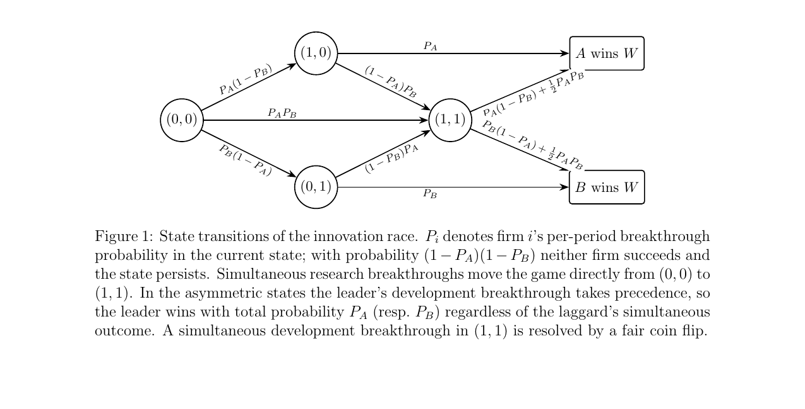
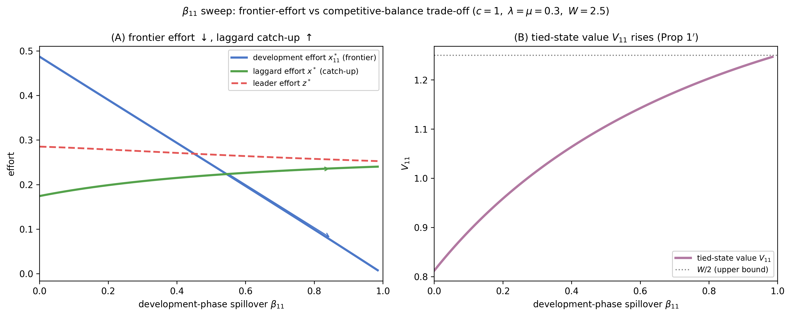
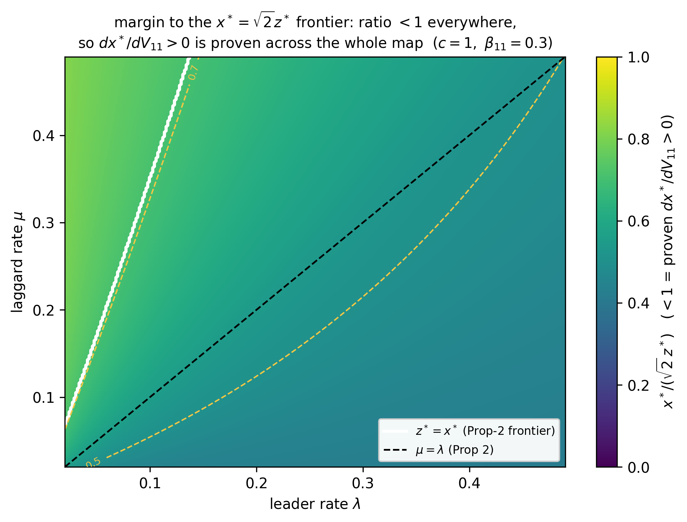
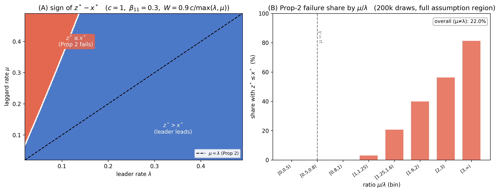
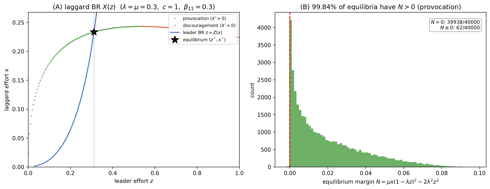
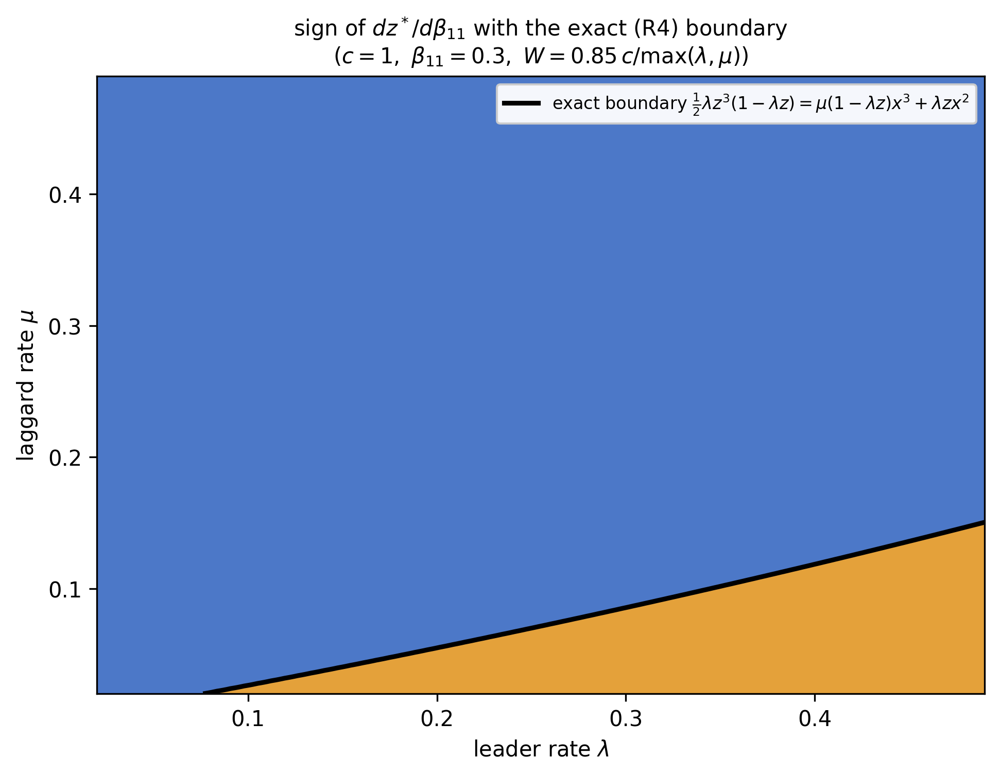
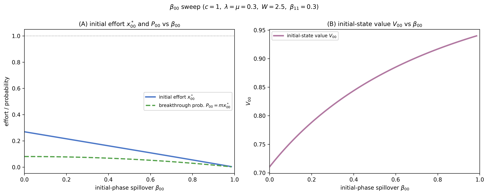
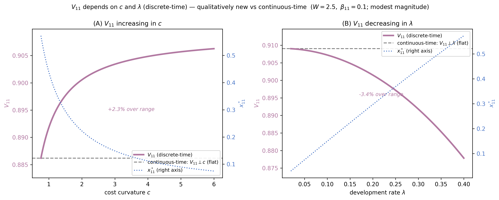

# Numerical Validation — Innovation Race with Knowledge Spillovers (detailed guide)

This is the detailed companion to [README.md](README.md). It walks through every result and every
figure. You don't need to run any code to follow it. The scripts are here so anyone can regenerate
everything with `bash run_all.sh`.

The repo validates the theory in the thesis: a discrete-time, two-firm, two-stage innovation race
with knowledge spillovers, solved as a Markov Perfect Equilibrium. Every closed form is checked
against an independent numerical solve of the underlying Bellman and first-order-condition system.
That way the figures rest on the model itself, not on the algebra being validated.

**Full writeup:** the complete thesis PDF (model, proofs, discussion) will be added after the
defense. This repo is the reproducible numerical side of Section 5.

---

## The model in one picture



Two firms race through two stages: research, then development. Each period a firm makes a
breakthrough with probability `Pᵢ`. That probability rises with its own effort, and with the
rival's effort through the spillover `β`. Both firms can succeed in the same period, so the game
can jump straight from `(0,0)` to `(1,1)`. In the asymmetric states the leader's development
breakthrough takes precedence. A simultaneous breakthrough in `(1,1)` is a fair coin flip
(expected prize `W/2`). Costs are quadratic (`c/2·x²`), the prize is winner-take-all `W`, and
there is no discounting.

**Maintained assumptions.** (A1) `x∈[0,1]`, `λ,μ<½`; (A2) `λW≤c`; (A2′) `μW≤c`. All scans draw
`W∈(0, c/max(λ,μ)]` so (A2) and (A2′) both hold.

---

## Results at a glance

A consolidated scan of **60,000** parameter draws re-checks every theorem and every numerical
claim. Finite-difference sign flags are re-verified at **50-digit precision** (`mpmath`).

**Within the maintained assumptions, no numerical claim breaks and every theorem passes. 0 hard
violations across all checks.** This was reproduced under a second random seed, and again after
the 7/11 draft edits (`numerics/task6_rerun_7-11.txt`).

| | Result | Outcome |
|---|---|---|
| **Closed forms** | `(1,1)` root vs independent Bellman+FOC solve | max diff **3.5×10⁻¹⁴** |
| **Theorems** | Δ>0, root selection, value ordering, Prop 1/2, master quadratic, BR slope | **0 / 60000** violations |
| **Prop 2** | leader out-invests laggard `z*>x*` at `μ=λ` | **0 / 30000** failures |
| **Catch-up** | `dx*/dβ₁₁>0` (higher spillover, more laggard effort) | **100%** of draws |
| **Transmission** | proven condition `x* < √2·z*` for `dx*/dV₁₁>0` | holds in **60000 / 60000** draws |
| **(0,0) state** | `Δ₀>0`, `x₀₀*∈(0,1)`, `mx₀₀*<1` | **0** violations, `min Δ₀≈0.02` |
| **Regularity** | `det J>0` at the equilibrium (now proven) | **0** violations |

---

## Key figures

### 1. The headline trade-off: frontier effort vs competitive balance


As the development-phase spillover `β₁₁` rises, symmetric frontier effort `x₁₁*` falls, while the
laggard's catch-up effort `x*` rises and the tied-state value `V₁₁` increases toward `W/2`. This
is the central mechanism: spillovers trade frontier intensity for competitive balance. The
catch-up channel works through the anticipated value of the tied state.

### 2. How far the transmission theorem reaches


The transmission result `dx*/dV₁₁ > 0` (which delivers the catch-up effect `dx*/dβ₁₁ > 0`) is now
a theorem whenever `x* < √2·z*`. This condition is strictly weaker than leader dominance. The
scans check how much of the parameter space satisfies it. Answer: all of it. 60,000 out of 60,000
draws across the `μ≠λ` region, including all 13,176 draws where leader dominance itself fails.
The √2 constant is also tight: an adversarial parameter sweep pushes the ratio `x*/(√2·z*)` to
0.99, and a limit probe drives it toward 1 without ever reaching it. So the paper reports a
conditional theorem plus a region-wide numerical verification of the condition.

### 3. Proposition 2 and its frontier


Leader dominance `z*>x*` holds at `μ=λ` (Prop 2, proven). It fails only when the laggard's
research rate `μ` gets well above the leader's development rate `λ`: never for `μ≤λ`, rising to
81% of draws for `μ/λ≥3` (22% overall). The equal-rate hypothesis is binding, not cosmetic.

### 4. The non-monotone laggard best response


The laggard's best response `X(z)` is non-monotone: `sign X′(z) = sign(μx(1−λz)² − 2λ²z²)`. Below
the threshold, higher leader effort *provokes* the laggard (erosion of `V₀₁` dominates). Above it,
classic discouragement. The equilibrium sits on the provocation arm in **99.9%** of the region.
A decluttered version of this picture for Section 4.2 is `figs/best_response_clean.png`.

### 5. The leader's response has an exact sign boundary


The sign of `dz*/dβ₁₁` is genuinely ambiguous (negative in about 95.5% of draws). But its boundary
is now exact: the sign equals the sign of the bracket `λz³(1−λz)/2 − μ(1−λz)x³ − λzx²`. The black
curve in the figure is that analytical boundary, not a fitted line. It matches the numerical sign
at all 40,000 scanned equilibria.

### 6. Initial-stage spillovers


Higher initial-phase spillover `β₀₀` lowers own initial effort `x₀₀*` and the breakthrough
probability, yet raises the initial-state value `V₀₀`. The spillover benefit outweighs the effort
reduction.

### 7. A qualitatively new dependence: `V₁₁` on `c` and `λ`


In discrete time `V₁₁` is increasing in `c` and decreasing in `λ`. This dependence is identically
flat in the continuous-time model. The magnitude is modest (a few percent; the figure uses
`β₁₁=0.1` for visibility). The contribution is the existence and sign of the dependence, not its
size. Two candidate replacements that drop the continuous-time framing are included:
`figs/c_lambda_V11_sweep_norefline.png` (no benchmark line) and
`figs/c_lambda_V11_sweep_limitline.png` (benchmark relabeled as the exact rare-breakthrough limit
`V₁₁ → (1+2β₁₁)W/(3(1+β₁₁))`). The final pick between them is pending; the original is unchanged.

<details>
<summary><b>Supporting / diagnostic figures</b> (click to expand)</summary>

- **`figs/corner_regime.png`** — outside (A2), interior `x₁₁*` exceeds 1 and the equilibrium is
  the corner `x*=1`. (A2) is conservative: the true corner onset is at `λW/c≈1.5–1.7`, not 1.
- **`figs/task3_00_diagnostics.png`** — `Δ₀>0`, interior `x₀₀*`, and `mx₀₀*<1−β₀₀` everywhere (0/60k).
- **`figs/dz_dbeta11_map.png`** — laggard response to `β₁₁` is positive everywhere; the leader's
  is sign-ambiguous (negative in ~96% of draws).
- **`figs/dx_dlam_reversals.png`** — the indirect `V₁₁` channel flips the sign of `dx*/dλ` in a
  thin high-`λ`/low-`μ` band (~2% of draws).
</details>

---

## Claim → script → figure map

| Script | Validates | Output |
|---|---|---|
| `numerics/task1_11_closedform.py` | `(1,1)` closed form vs independent solve; corner regime | `figs/corner_regime.png`, `task1_corner_reference.csv` |
| `numerics/task2_asymmetric.py` | asymmetric fixed point; Prop 2; `μ≠λ` frontier | `figs/prop2_frontier.png` |
| `numerics/task3_initial_state.py` | `(0,0)`: `Δ₀>0`, interiority, unconditional `dx₀₀*/dV₁₀` | `figs/task3_00_diagnostics.png`, `task3_violations.csv` (empty) |
| `numerics/task4_comparative_statics.py` | `dx*/dβ₁₁`, `dz*/dβ₁₁`, `dx*/dλ` reversals, provocation, `det J` | `figs/dz_dbeta11_map.png`, `dx_dlam_reversals.png`, `laggard_BR.png` |
| `numerics/task5_paper_figures.py` | `β₁₁`, `β₀₀`, `c`, `λ` sweeps | `figs/beta11_sweep.png`, `beta00_sweep.png`, `c_lambda_V11_sweep.png` |
| `numerics/task6_summary.py` | consolidated confirmation + break-region map (seed 202) | `task6_confirmation.txt` |
| `numerics/task6_confirmation.py` | independent consolidated re-scan (seed 11) | `task6_confirmation_table.csv` |
| `numerics/task6_diagnose_signs.py` | 50-digit mpmath re-check of FD sign flags | console |
| `numerics/verify_dx_dV11.py` | candidate transmission identities (symbolic) | console |
| `verify_scripts/verify_step8_transmission.py` | independent rebuild: `det J` decomposition, Cramer numerators, `√2` condition, leader sign bracket | `numerics/step8_results.txt` |
| `numerics/task7_transmission_scans.py` | reach and tightness of the `√2` condition; leader sign boundary vs numerics | `task7_results.txt`, `task7_margin_addendum.txt`, `figs/prop2_frontier_sqrt2_overlay.png`, `figs/dz_dbeta11_map_R4overlay.png` |
| `numerics/task8_c_lambda_regen.py` | `c`/`λ` figure variants without continuous-time framing | `figs/c_lambda_V11_sweep_norefline.png`, `figs/c_lambda_V11_sweep_limitline.png` |
| `numerics/task9_br_clean_fig.py` | clean best-response figure for Section 4.2 | `figs/best_response_clean.png` |

The full write-up of the confirmation, the break-region map, and honest caveats is in
**[`numerics/SUMMARY_memo.md`](numerics/SUMMARY_memo.md)**. The `verify_scripts/` folder holds the
SymPy scripts that verify the analytical derivations (Steps 2–6 and 8) symbolically.

---

## Confirmation detail

**Theorems (0 violations, cross-checked over 60k draws).** Δ=(u−c)²+8c²>0; subtracted-root
selection; key inequality √Δ>3c−u; value ordering `0≤V₀₁≤V₁₁<W/2≤V₁₀≤W`; Prop 1 (`x₁₁*` signs);
Prop 2; laggard BR slope identity; additive-root best responses solve their quadratics (residual
≤9.5×10⁻¹⁵); the master-quadratic identity `F₀₀[terminal subs] − F₁₁ ≡ 0` (verified symbolically).

**The transmission package (new).** Step 8 verifies, as exact symbolic zeros: the BR slope
identities, the closed form of `det J` plus a decomposition into terms that are each nonnegative
under (A1) (so `det J > 0` is proven, not just observed), and the Cramer numerators for
`dx*/dV₁₁` and `dz*/dV₁₁`. The `dx*/dV₁₁` numerator is positive whenever `x* < √2·z*`, which
gives the conditional transmission theorem. Numeric spot checks at 20,000 solved equilibria:
0 violations, Cramer vs finite difference max relative error 6.7×10⁻⁶.

**Sign-flag caveat, resolved.** Naive finite differences flag 221 cases for Prop 1′ (`V₁₁` signs)
and 18 for Prop 3 (`x₀₀*` signs). All are near-zero-derivative artifacts: `dV₁₁/dc` near its
`c→∞` saturation, and `dx₀₀*/dV₁₁ ∝ μ²` at tiny `μ`. At 50-digit precision every flagged case
recovers the correct sign. **0 real violations.**

**Break-region map (validity boundary).** Relaxing each assumption one at a time shows they mark
real boundaries, not mere convenience:

| Relaxation | What breaks | Frequency |
|---|---|---|
| (A2) `λW>c` | interior `x₁₁*>1` → corner `x*=1` | 19.8% of tested band (in-region: 0%) |
| `μ=λ → μ≠λ` | Prop 2 `z*>x*` fails | 22.1% |
| (A2′) `μW>c` | `(0,0)` interiority | 0 violations (analytical proofs need it; numerics robust) |

**Still numerical, not proven.** `det J > 0`, uniqueness of the asymmetric fixed point, and the
conditional `dx*/dV₁₁ > 0` are now theorems (Appendix C.5 of the draft). What remains numerical:
the region-wide coverage of the `√2` condition, the ~95.5% negative share of `dz*/dβ₁₁` (no
general claim is made), the ~2% reversal share of `dx*/dλ`, the ~99.9% provocation share, and the
convergence of best-response iteration itself (it converged in every draw, which supports but
does not prove stability).

---

## Reproduce

Requires Python 3.10+ and the packages in `requirements.txt` (`numpy`, `matplotlib`, `sympy`,
`mpmath`; no SciPy needed, the independent solvers are hand-rolled bisection / value iteration).

```bash
pip install -r requirements.txt
bash run_all.sh          # regenerates every figure and log (a few minutes)
```

Each script is self-contained and writes to `figs/` and `numerics/`. Scans reuse fixed seeds for
parity (residual tolerance `1e-9`, iteration tolerance `1e-13`). Two large regenerable CSVs
(`task2_frontier_grid.csv`, `task7_sqrt2_grid.csv`) are gitignored; the tasks that produce them
recreate them.

---

## Repository layout

```
numerical-validation/
├── README.md                 short guide
├── README_detailed.md        this file
├── requirements.txt
├── run_all.sh
├── figs/                     all figures (PNG, 300 dpi)
├── numerics/                 validation scripts, logs, small data, SUMMARY_memo.md
└── verify_scripts/           SymPy scripts (analytical verification, Steps 2–6 and 8)
```
