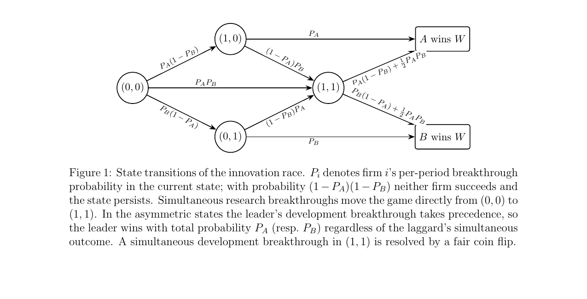
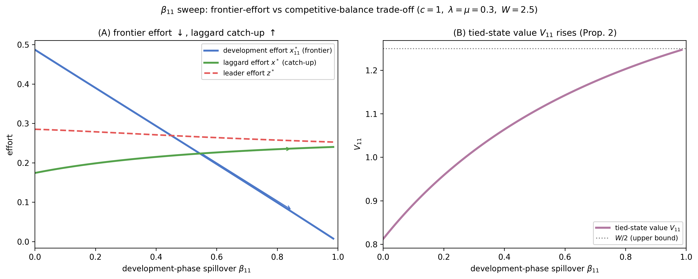
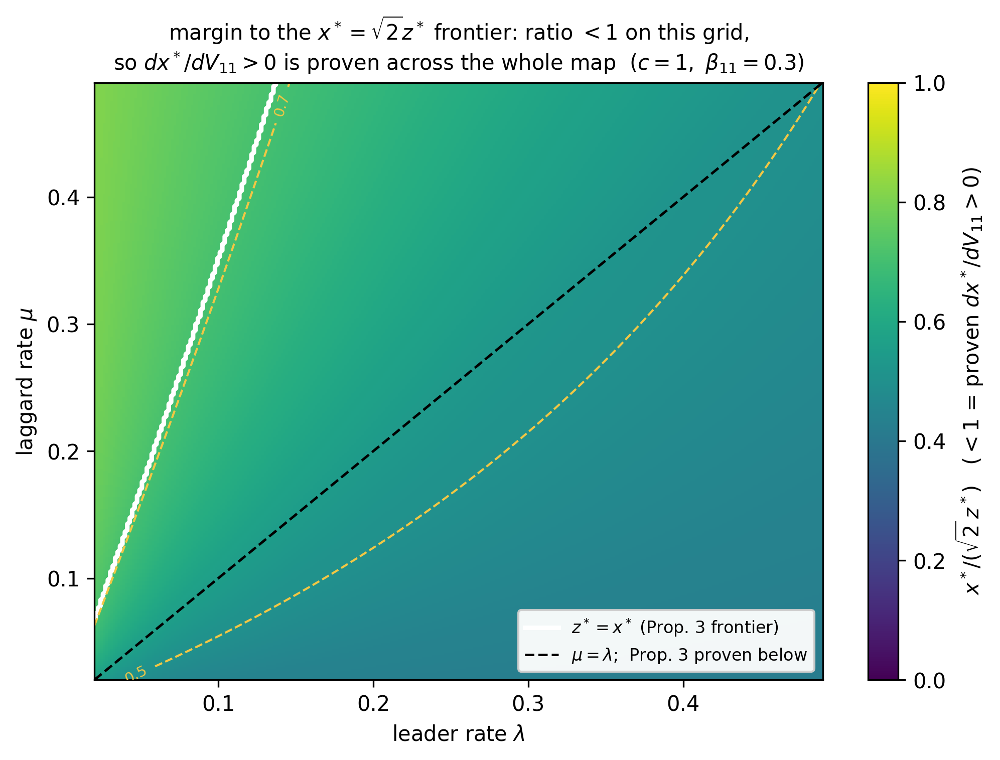
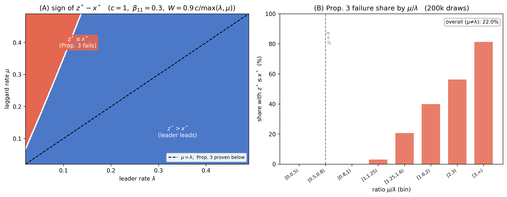
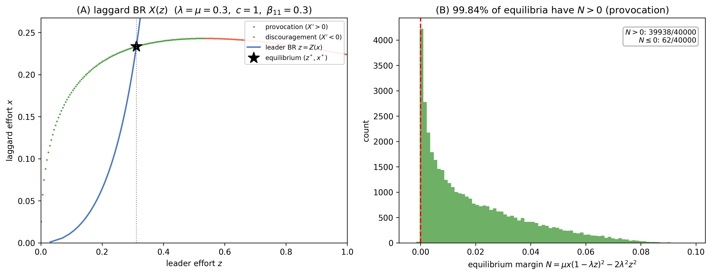
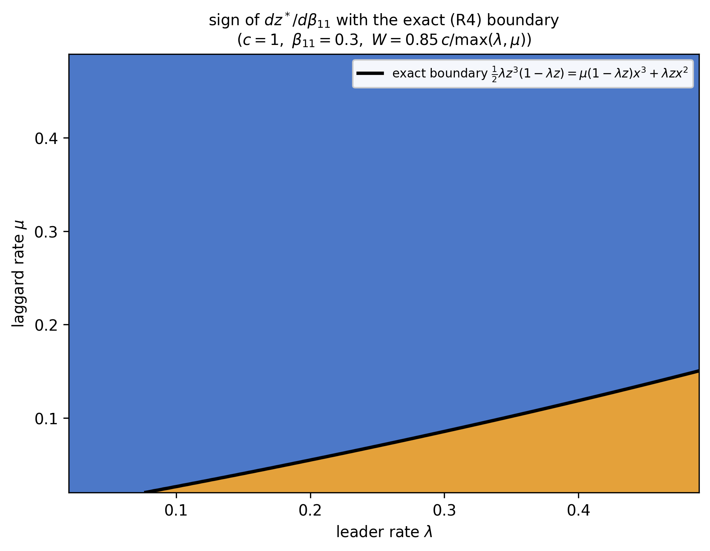
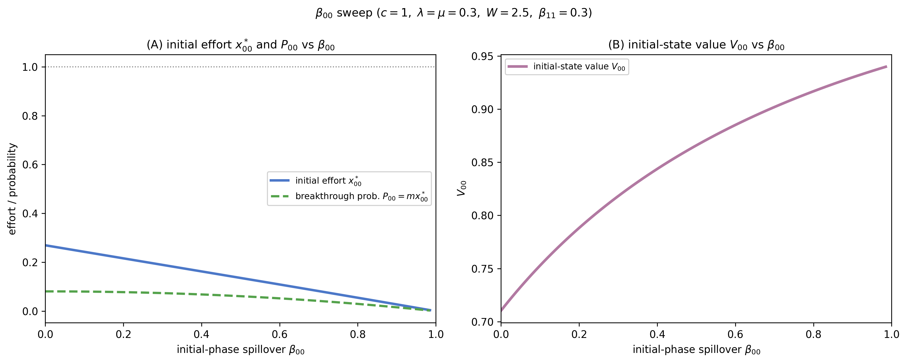
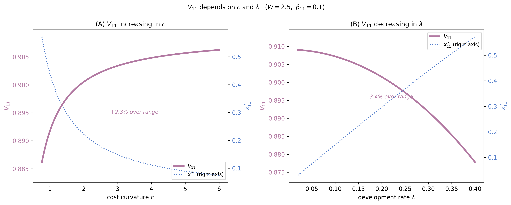

# Numerical validation — detailed guide

The companion to [README.md](README.md). It walks through every result and every figure.
You do not need to run anything to follow it; the scripts are here so that anyone can
regenerate the whole thing with `bash run_all.sh`.

The thesis is a discrete-time, two-firm, two-stage innovation race with knowledge
spillovers, solved as a Markov Perfect Equilibrium. This repo checks every closed form
against an independent numerical solve of the Bellman and first-order-condition system,
so the figures rest on the model rather than on the algebra being tested.

Full paper: `Ellahi_2026_Innovation_Race_Spillovers.pdf`. This is the reproducible side
of its Section 5.

Results are referred to by name and number — "leader dominance (Proposition 3)" — because
numbers move between drafts and names do not.

---

## The model



Two firms race through two stages: research, then development. Each period a firm breaks
through with probability `Pᵢ`, which rises with its own effort and, through the spillover
`β`, with its rival's. Both firms can succeed in the same period, so the game can jump
straight from `(0,0)` to `(1,1)`. In the asymmetric states the leader's development
breakthrough takes precedence. A simultaneous breakthrough in `(1,1)` is settled by a coin
flip, worth `W/2` in expectation. Costs are quadratic, `c/2·x²`, the prize is
winner-take-all `W`, and there is no discounting.

Spillovers only operate between firms in the same stage: `β₀₀` in research, `β₁₁` in
development, and `β = 0` when one firm leads. A firm still in research cannot absorb its
rival's late-stage advances.

**Maintained assumptions.** (A1) `x ∈ [0,1]`, `λ, μ < ½`; (A2) `λW ≤ c`; (A2′) `μW ≤ c`.
Scans draw `W ∈ (0, c/max(λ,μ)]` so (A2) and (A2′) both hold.

**Notation.** `M ≡ λ(1+β₁₁)` and `m ≡ μ(1+β₀₀)` are the effective probability slopes in the
two symmetric states. `u ≡ λ²W(1−β₁₁²)`. `D ≡ V₁₀ − V₀₁` is the value gap and
`G ≡ V₁₀ + β₀₀V₀₁ − (1+β₀₀)V₁₁`. Efforts: `x₁₁*` at the frontier, `z*` (leader) and `x*`
(laggard) in the asymmetric states, `x₀₀*` at the start.

---

## Method

The independent solver never uses the closed forms. It solves the Bellman equations and
first-order conditions directly — bisection in the symmetric states, best-response
iteration in the asymmetric ones, to an iteration tolerance of `1e-13`.

The checks come in three layers:

1. **SymPy.** Every algebraic identity in the appendices — the master-quadratic
   substitution, the best-response factorizations, the cross-partials, the Jacobian
   determinant, the two Cramer numerators — must simplify to exact zero. No tolerance
   is involved.
2. **Finite differences.** Comparative-statics signs are checked at solved equilibria.
3. **mpmath at 50 digits.** A finite difference near zero cannot resolve a sign, so every
   flagged case is re-solved at high precision and decided there.

Every claim in the thesis carries a status: proven, or numerical. The scans confirm the
proven ones (guarding against algebra error, not supplying evidence) and are the only
support for the numerical ones.

---

## Results at a glance

Two independent confirmation scans of 60,000 draws each (seeds 202 and 707), plus a third
under seed 11, re-check every theorem and every numerical claim.

**Within the maintained assumptions nothing breaks: every theorem passes and no numerical
claim fails.**

| | Result | Outcome |
|---|---|---|
| **Closed forms** | `(1,1)` root vs independent Bellman + FOC solve | max diff **3.5×10⁻¹⁴** |
| **Theorems** | Δ>0, root selection, value ordering, Props 1–4, master quadratic, BR slope | **0** violations |
| **Leader dominance (Prop. 3)** | `z* > x*` for `μ ≤ λ` | **0** failures |
| **Catch-up** | `dx*/dβ₁₁ > 0` | **100%** of draws |
| **Transmission** | proven condition `x* < √2·z*` for `dx*/dV₁₁ > 0` | **60000 / 60000** |
| **(0,0) state** | `Δ₀ > 0`, `x₀₀* ∈ (0,1)`, `mx₀₀* < 1` | **0** violations, `min Δ₀ ≈ 0.021` |
| **Regularity** | `det J > 0` (proven, and checked) | **0** violations |

---

## Figures

### 1. Frontier effort against competitive balance


As `β₁₁` rises, symmetric frontier effort `x₁₁*` falls while the laggard's catch-up effort
`x*` rises and the tied-state value `V₁₁` climbs toward `W/2`. Spillovers trade frontier
intensity for competitive balance, and the catch-up channel runs entirely through the
anticipated value of the tied state. Drawn at `c=1`, `λ=μ=0.3`, `W=2.5`.

### 2. How far the transmission theorem reaches


Transmission, `dx*/dV₁₁ > 0`, is a theorem whenever `x* < √2·z*` — a condition strictly
weaker than leader dominance. The scans ask how much of the parameter space satisfies it.
All of it: 60,000 out of 60,000 draws across the `μ ≠ λ` region, including all 13,176
draws where leader dominance itself fails.

On this grid the ratio `x*/(√2·z*)` peaks at 0.813, but an adversarial corner sweep pushes
it to 0.9894 and a limit probe reaches 0.99999 as `λ → 0`, `β₁₁ → 1`, `μ → ½`, without ever
attaining 1. So the hypothesis comes close to binding. That is a statement about the
hypothesis, not the conclusion: √2 is where one of three terms in the transmission
numerator changes sign, and the other two stay positive, so `dx*/dV₁₁ > 0` may well hold
past it. The thesis therefore reports a conditional theorem plus a region-wide numerical
check of the condition, rather than an unconditional claim.

### 3. Leader dominance and its frontier (Proposition 3)


The leader out-invests the laggard, `z* > x*`, whenever `μ ≤ λ`. That is proven. It fails
only above the diagonal: never for `μ ≤ λ`, 22% of `μ ≠ λ` draws overall, rising to 81%
once `μ/λ ≥ 3`. **Every failure has `μ > λ`**, so the hypothesis is one-sided — only a
laggard with a faster research technology than the leader's development technology can
overturn the ordering.

### 4. The laggard's best response is not monotone


`sign X′(z) = sign(μx(1−λz)² − 2λ²z²)`. Below the threshold, a stronger leader *provokes*
the laggard: the erosion of `V₀₁` dominates and the laggard fights harder. Above it, the
shrinking `(1−λz)` factor takes over and the laggard retreats. Equilibria sit on the
provocation arm 99.8–99.9% of the time, so discouragement here is a level effect rather
than a collapsing response. `figs/best_response_clean.png` is the decluttered version used
in Section 4.2 of the thesis.

### 5. The leader's response has an exact sign boundary


The sign of `dz*/dβ₁₁` is ambiguous — negative in about 95.5% of draws — but its boundary
is exact: the sign equals that of `λz³(1−λz)/2 − μ(1−λz)x³ − λzx²`. The black curve is that
formula, not a fit, and it matches the numerical sign at all 40,000 scanned equilibria. The
panel is one `(c, β₁₁, W)` slice; across the full region the positive share is 4.5%.

### 6. Initial-stage spillovers


Higher `β₀₀` lowers initial effort `x₀₀*` and the breakthrough probability, yet raises the
initial-state value `V₀₀`. Ex ante both firms prefer a starting line with more diffusion.
That last observation is numerical, not proven.

### 7. `V₁₁` depends on `c` and `λ`


In discrete time `V₁₁` rises with `c` and falls with `λ`. The dependence is identically flat
in the continuous-time model, so its existence and sign are the contribution; the magnitude
is small, +2.3% and −3.4% over the sweep ranges. The figure uses `β₁₁ = 0.1` for visibility.
It matters because it forces the direct-versus-total decomposition in the asymmetric states:
when `c` or `λ` moves, incentives shift twice, once directly and once through `V₁₁`.

<details>
<summary><b>Supporting and diagnostic figures</b></summary>

- **`figs/corner_regime.png`** — outside (A2) the interior root exceeds 1 and the
  equilibrium is the corner `x* = 1`. (A2) is conservative: the true corner onset is at
  `λW/c ≈ 1.5–1.7`, not 1.
- **`figs/task3_00_diagnostics.png`** — `Δ₀ > 0`, interior `x₀₀*`, and `mx₀₀* < 1−β₀₀`
  everywhere. The last of these is what makes `∂x₀₀*/∂V₁₀ > 0` unconditional.
- **`figs/dx_dlam_reversals.png`** — the indirect `V₁₁` channel flips the sign of `dx*/dλ`
  in a thin high-`λ`/low-`μ` wedge, about 2% of draws.
- **`figs/c_lambda_V11_sweep_limitline.png`** — the same sweep with the rare-breakthrough
  limit `V₁₁ → (1+2β₁₁)W/(3(1+β₁₁))` drawn as a reference line.
- **`figs/dz_dbeta11_map.png`** — the `dz*/dβ₁₁` sign map without the analytical overlay.

</details>

---

## Claim → script → figure → thesis

| Script | Validates | Thesis | Output |
|---|---|---|---|
| `numerics/task1_11_closedform.py` | `(1,1)` closed form vs independent solve; corner regime | §4.1, App. A | `figs/corner_regime.png`, `task1_corner_reference.csv` |
| `numerics/task2_asymmetric.py` | asymmetric fixed point; leader dominance; `μ≠λ` frontier | §4.2, App. C.3 | `figs/prop2_frontier.png` |
| `numerics/task3_initial_state.py` | `(0,0)`: `Δ₀>0`, interiority, unconditional `∂x₀₀*/∂V₁₀` | §4.3, App. D | `figs/task3_00_diagnostics.png`, `task3_violations.csv` (empty) |
| `numerics/task4_comparative_statics.py` | `dx*/dβ₁₁`, `dz*/dβ₁₁`, `dx*/dλ` reversals, provocation, `det J` | §4.2, §5.5 | `figs/dz_dbeta11_map.png`, `dx_dlam_reversals.png`, `laggard_BR.png` |
| `numerics/prop2_dag_identity.py` | the equilibrium identity `L·V₁₁ = R·(W−V₁₁)` | App. C.3 step 1 | console |
| `numerics/prop2_extension_symbolic.py` | `Φ` affine in `μ`; both endpoints positive for `x ≥ z` | App. C.3 step 2 | console |
| `numerics/prop2_extension_check.py` | random search for a counterexample to `Φ ≥ 0` | App. C.3 | console |
| `numerics/task5_paper_figures.py` | `β₁₁`, `β₀₀`, `c`/`λ` sweeps | §4.1–4.3 | `figs/beta11_sweep.png`, `beta00_sweep.png`, `c_lambda_V11_sweep.png` |
| `numerics/task6_summary.py` | consolidated confirmation + break regions, seed 202 | §5.2 | `task6_confirmation.txt` |
| `numerics/task6_diagnose_signs.py` | 50-digit adjudication of the seed-202 flags | §5.2 | console |
| `numerics/task6_seed707.py` | the same battery on a second fresh seed | §5.2 | `task6_seed707.txt` |
| `numerics/task6_diagnose_seed707.py` | 50-digit adjudication of the seed-707 flags | §5.2 | `task6_diagnose_seed707.txt` |
| `numerics/task6_confirmation.py` | independent re-scan, seed 11 | §5.2 | `task6_confirmation_table.csv`, `task6_results.txt` |
| `numerics/task7_transmission_scans.py` | reach and tightness of `x* < √2·z*`; leader sign boundary | §5.5 | `task7_results.txt`, `task7_margin_addendum.txt`, two figures |
| `numerics/task8_c_lambda_regen.py` | `c`/`λ` figure variants | §4.1 | `c_lambda_V11_sweep_norefline.png`, `_limitline.png` |
| `numerics/task9_br_clean_fig.py` | best-response figure | §4.2 | `figs/best_response_clean.png` |
| `verify_scripts/verify_step8_transmission.py` | `det J` decomposition, Cramer numerators, leader sign bracket | App. C.5 | `numerics/step8_results.txt` |

### Symbolic verification of the appendices

`verify_scripts/` re-derives each appendix in SymPy and asserts the result. Every
identity must come out exactly, so these scripts print PASS or FAIL per check rather
than a tolerance. `run_all.sh` runs them in the order the appendices appear.

| Script | Appendix | Verifies |
|---|---|---|
| `verify_step2.py` | A.1 | Bellman → FOC → the `(1,1)` equilibrium quadratic |
| `verify_step2b.py` | A.3 | root selection and interiority (Lemma 2) |
| `verify_step2c.py` | A.3 | (A2) `λW ≤ c` is sufficient for an interior root |
| `verify_step3.py` | B.2 | effort comparative statics (Proposition 1) |
| `verify_step3c.py` | B.2 | the same signs by exact polynomial division; the key inequality (Lemma 6) |
| `verify_step3d.py` | B.4 | `∂V₁₁/∂β₁₁ > 0` (Proposition 2): first that the appendix expression is the derivative, then the `T1`/`T2` factorization that signs it |
| `verify_step4.py` | D.1 | the `(0,0)` equilibrium quadratic |
| `verify_step4b.py` | D.2, D.3 | master quadratic (Lemma 4) and root selection (Lemma 5) |
| `verify_step4c.py` | D.4 | the small-`μ` limit |
| `verify_step5.py` | C.1 | the best-response quadratics and additive-root selection |
| `verify_step5d.py` | C.4 | the laggard best-response slope, `sign X′ = sign N` |
| `verify_step6.py` | D | `(0,0)` comparative statics (Proposition 4) |
| `verify_step8_transmission.py` | C.5 | `det J`, the Cramer numerators, the leader sign bracket |

`verify_step5b.py` is the reference full-system solver the scan scripts import from;
it is not a proof check, so `run_all.sh` does not call it directly.

---

## Confirmation detail

**Theorems, 0 violations.** `Δ = (u−c)² + 8c² > 0`; subtracted-root selection; the key
inequality `√Δ > 3c−u`; value ordering `0 ≤ V₀₁ ≤ V₁₁ < W/2 ≤ V₁₀ ≤ W`; frontier effort
signs (Prop. 1); tied-state value signs (Prop. 2); leader dominance (Prop. 3); early-effort
signs (Prop. 4); the laggard BR slope identity; additive-root best responses solving their
quadratics to a residual below 9.5×10⁻¹⁵; and the master-quadratic identity
`F₀₀[terminal subs] − F₁₁ ≡ 0`, verified symbolically.

Smallest discriminants over the confirmation scan: `min Δ = 0.0229` and `min Δ₀ = 0.0203`
under seed 202, `min Δ₀ = 0.0213` under seed 11. The thesis quotes the seed-11 figure.

**The transmission package.** `verify_step8_transmission.py` verifies five identities as
exact symbolic zeros:

| Identity | Consequence |
|---|---|
| `G_L,x` at `G_L = 0` equals `−cλz²/(2x)` | the leader's best-response slope |
| `G_F,z` at `G_F = 0` equals `−cxN/(2z(1−λz))` | the laggard's slope; `N` is the provocation bracket |
| `det J = c²·[core]`, plus a decomposition into nonnegative terms | `det J > 0` proven under (A1), not merely observed |
| Cramer numerator for `dx*/dV₁₁` | `dx*/dV₁₁ > 0` proven whenever `x* < √2·z*` |
| Cramer numerator for `dz*/dV₁₁` | the exact sign boundary for `dz*/dβ₁₁` |

Spot checks at 20,000 solved equilibria (seed 8): 0 violations, and Cramer against finite
difference to a maximum relative error of 3.6×10⁻⁸ in `x` and 6.7×10⁻⁶ in `z`.

**The sign flags, resolved.** Naive finite differences flag 239 cases on seed 202 — 221 of
them on `∂V₁₁/∂c`, 18 on `∂x₀₀*/∂V₁₁` — and 236 on seed 707. Both slots have the same
cause: `∂V₁₁/∂c` sits near its large-`c` saturation, where the true derivative drops below
float resolution, and `∂x₀₀*/∂V₁₁ ∝ μ²` is tiny at very small `μ`. At 50 digits every
flagged case recovers the proven sign. **0 real violations on either seed.**

**Break regions.** Relaxing each assumption one at a time shows they mark real boundaries.

| Relaxation | What breaks | Frequency |
|---|---|---|
| (A2) `λW > c` | interior `x₁₁* > 1` → corner `x* = 1` | 19.8–20.0% of the tested band (0% in region) |
| `μ ≤ λ` → `μ > λ` | leader dominance `z* > x*` | 22.1% of `μ ≠ λ` draws, all with `μ > λ` |
| (A2′) `μW > c` | `(0,0)` interiority | 0 violations — the assumption buys the proofs, not the behaviour |

**Still numerical.** `det J > 0`, uniqueness of the asymmetric fixed point, and the
conditional `dx*/dV₁₁ > 0` are now theorems (Appendix C.5). What remains numerical: the
region-wide coverage of the `√2` condition; the ≈95.5% negative share of `dz*/dβ₁₁`, on
which no general claim is made; the ≈2% reversal share of `dx*/dλ`; the ≈99.9% provocation
share; and the convergence of best-response iteration, which held in every draw and supports
but does not prove stability.

---

## Reproduce

Python 3.10+ and the packages in `requirements.txt` (`numpy`, `matplotlib`, `sympy`,
`mpmath`). No SciPy: the independent solvers are hand-rolled bisection and value iteration,
which is what makes them independent.

```bash
pip install -r requirements.txt
bash run_all.sh          # ~90 seconds
```

Each script is self-contained and writes to `figs/` and `numerics/`. Residual tolerance
`1e-9`, iteration tolerance `1e-13`, figures PNG at 300 dpi. Seeds: 11, 21, 31 for the core
scans; 101 for the 200,000-draw leader-dominance frontier; 41 and 43 for the transmission
scans; 8 for the Jacobian spot checks; 202 and 707 for the confirmation battery. Two large
regenerable CSVs (`task2_frontier_grid.csv`, `task7_sqrt2_grid.csv`) are gitignored and are
recreated by the scripts that produce them.

---

## Layout

```
numerical-validation/
├── README.md                  short guide
├── README_detailed.md         this file
├── requirements.txt
├── run_all.sh
├── figs/                      figures (PNG, 300 dpi)
├── numerics/                  scripts, logs, small data
└── verify_scripts/            SymPy verification of Appendices A-D
```
